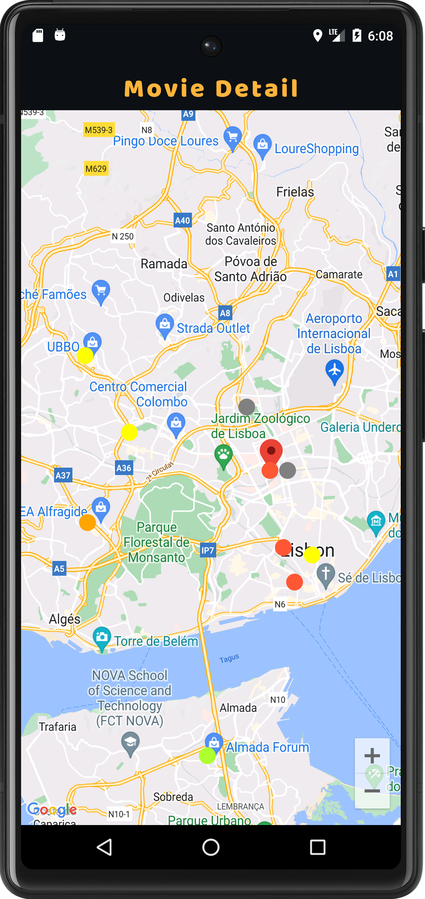
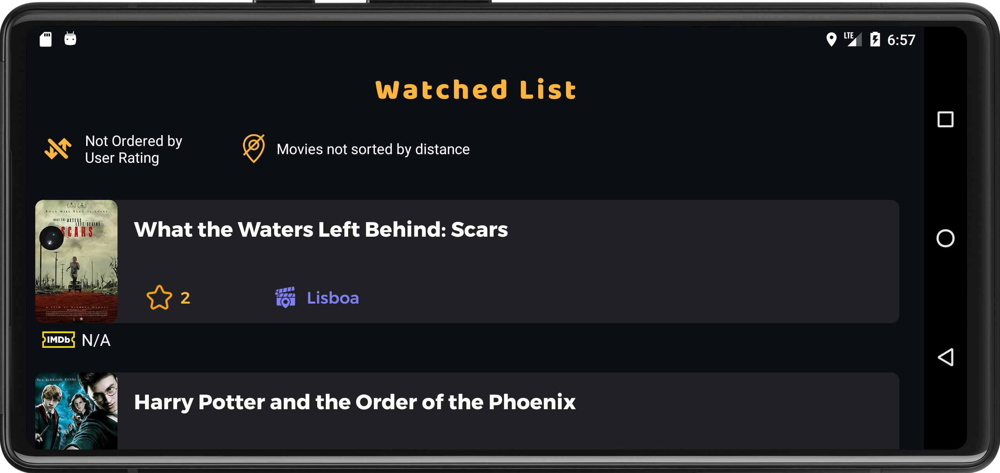
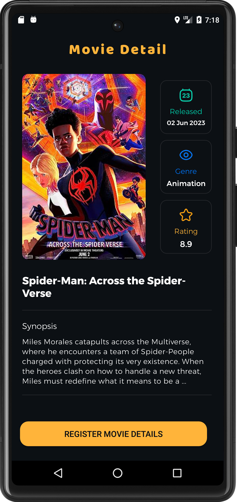
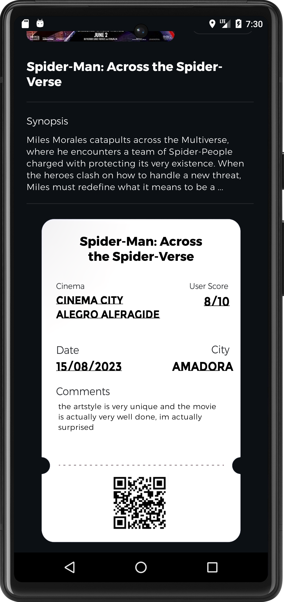
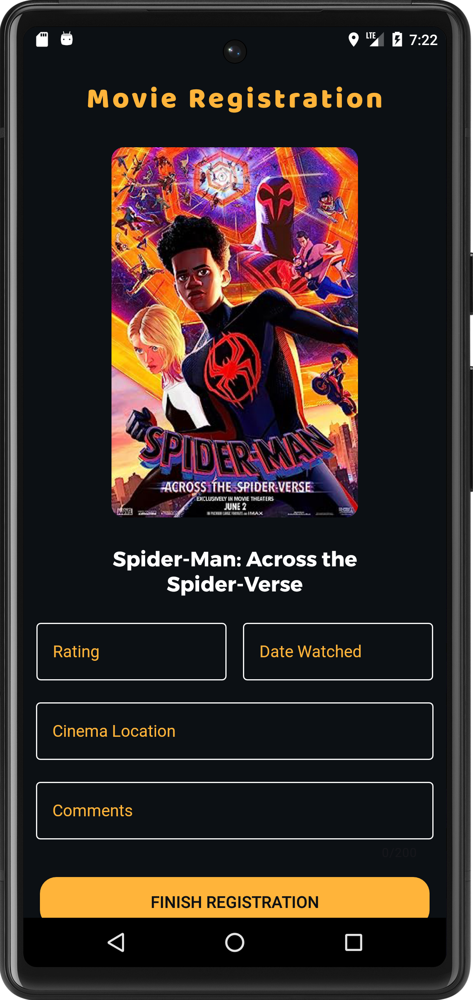
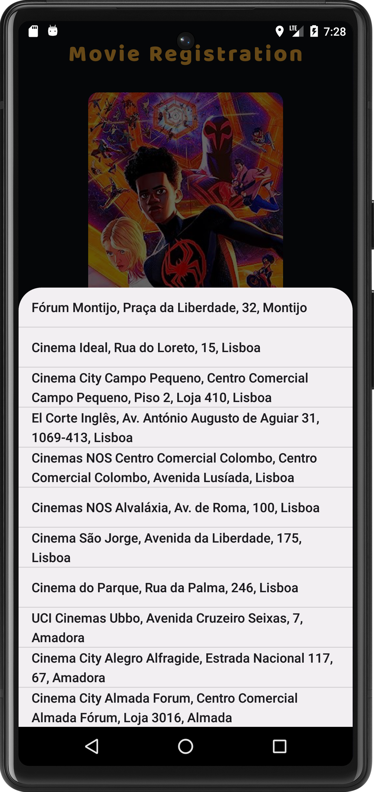
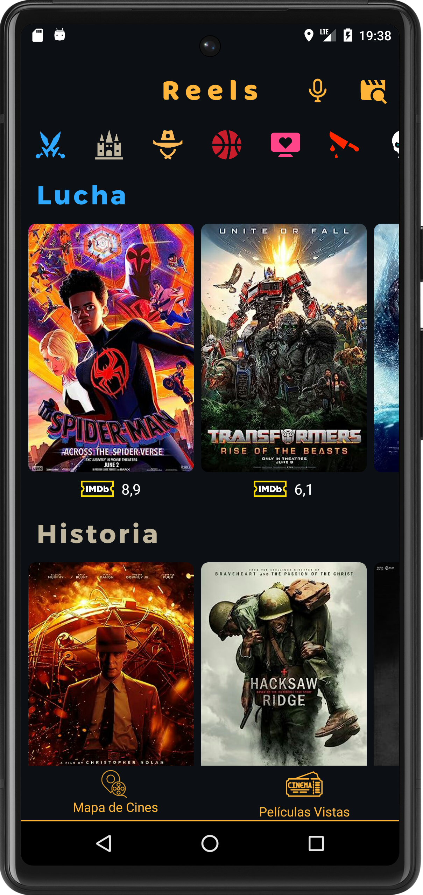
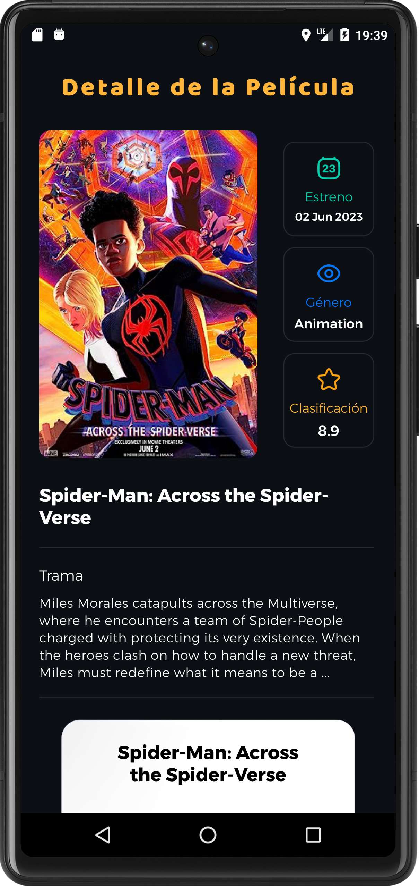

# README

# Nome dos elementos do grupo
 - Filipe Cacho, a21702361, LEI

# Nota importante
Este projeto foi desenvolvido no emulador do android studio utilizando o telefone **"Pixel 6".**

O UI é uma parte muito importante desta app e portanto é aconselhado utilizar o mesmo telefone no android studio ou pelo menos um com dimensões semelhantes. **O pixel 6 tem uma resolução de 1080x2400, e 412dps por 915dps**

 # Tabela de avaliação

Nesta seção está a tabela de avaliação e a indicação da implementação dos requisitos. Após a tabela encontra-se uma descrição detalhada dos ecrãs da app e o link do video

| Descrição |Implementado |
| --- | --- |
| Regista Já | Sim |
| Registo de filmes | Sim |
| Inserir corretamente na base de dados | Sim |
| Validação e obtenção dos dados dos filme via API | Sim |
| Validação e obtenção dos dados do cinema via JSON | Sim |
| Utilização de geo-localização | Sim |
| Apresentação dos filmes -Lista  | Sim |
| Apresentação dos filmes - Mapa  | Sim |
| Filtros - Apresentação em Lista   | Sim |
| Ordenação - Apresentação em Lista   | Sim |
| Detalhe do filme (sem fotografias)   | Sim |
| Detalhe do filme (apenas a parte das fotografias)  | Não |
| Pesquisa de filmes por voz - Funcionalidade Avançada  | Sim |
| Dashboard  | Sim |
| Funcionamento Offline - Funcionalidade Avançada  | Sim |
| Video   | Sim |
| Extra  | Sim |
| Ficheiro chatgpt.txt (ver secção Requisito Bónus - Interação com chatgpt)  | Sim |
| --- | --- |
| Total  | 19 valores |

## Funcionalidade extra
Após a tabela é descrito com detalhe como funciona a app, é descrito que foram implementadas pelo menos 2 funcionalidades extra, como por exemplo a pesquisa de filmes pelo API para permitir ao utilizador registar qualquer filme que exista.

Segundo o que o enunciado diz, a app deve devolver filme não encontrado quando o utilizador procura por um filme que não está na App. Eu decidi portanto ir além disso e implementar uma forma de permitir ao utilizador procurar no API qualquer filme válido. Não sendo esse um requisito explicito do enunciado, este é um dos extras implementados.

O outro requisito extra é a horizontal scroll view que permite ao utilizador facilmente escolher filmes de uma categoria.

Tendo em conta estes 2 extras implementados e o seu correto funcionamento, creio puder dizer com confiança que posso ter cotação total na secção dos extras.
 
# Funcionalidades & Screenshots

## Ecrã principal

### Status Bar
O 1º elemento que se encontra no topo do ecra é a status bar que contem 3 elementos:
- O titulo da Aplicação, que é "Reels"
- O icone do microfone que ativa a pesquisa por voz
- O icone de pesquisa por texto que ativa a search view para procurar um filme por texto

#### Pesquisar filme por voz

Quando se pressiona o icone do microfone na status bar, isso invoca um menu que utiliza o serviço de reconhecimento de voz do google para traduzir o que o utilizador diz em texto **(este serviço só funciona quando o equipamento tem acesso à internet)**

**Esta funcionalidade consegue encontrar qualquer filme registado ou não registado na aplicação, isto,porque este menu faz uma pesquisa no API pelo filme e caso este exista a informação sobre o filme é imediatamente carregada para a App permitindo ao utilizador registar qualquer filme que queira.
Isto foi uma funcionalidade extra que eu implementei e que eu acho que é de grande uso para o utilizador porque permite ao utilizador registar qualquer filme não estando limitado aos filmes que possam estar hardecoded na App**

#### Pesquisa de filme por texto

Ao pressionar o icone de pesquisa por texto (o que se encontra no lado direito do icone do microfone) o utilizador invoca uma search view aonde pode escrever o nome de qualquer filme que esteja registado na aplicação ou no API. O que vai acontencer é o seguinte:
- Se o utilizador escrever o nome completo  de um filme e este corresponde a um titulo válido de um filme já registado na app o utilizador vai ser levado para o ecrã do detalhe do filme. Isto permite fazer pesquisa de filmes já registados em modo offline desde que o titulo inserido corresponda letra por letra ao titulo do filme (não é preciso inserir nenhuma letra em maiscula).
- Caso o titulo inserido do filme não corresponda a nenhum filme registado na app, é feita uma pesquisa no API (se não houver internet a app devolve um erro em forma de mensagem Toast). O API devolve os dados de um filme que achou ser o correto e esses dados são descarregados e processados na app levando o utilizador para o registo do filme (caso o API não encontre o filme a app devolve um erro em forma de mensagem de Toast)

### Scroll Bar horizontal
Por debaixo da Status Bar da aplicação vê-se um conjunto de icones. Isto é uma das funcionalidades extra que implementei que utiliza uma scroll view horizontal, que quando o utilizador carrega num dos icones, o ecrã faz scroll para cima ou baixo para a recycler view correspondente ao icone pressionado. 

A cor do icone corresponde ao titulo da recycler view, por exemplo o primeiro icone é azul que corresponde ao "Fight movies", o segundo icone é castanho claro que corresponde aos "History movies", etc.

### Posters dos filmes (recycling views)
O ecrã principal é alimentado por **8 recycler views verticais**, cada uma representa um género diferente de filmes. Se o utilizador navegar horizontalmente numa recycling view irá ver mais filmes do mesmo género (max 20 por recycling view) e se navegar verticalmente na aplicação irá ver outras recycling views com filmes de outros géneros. 

Cada filme tem debaixo do poster a classificação IMDB retirada do API

## Barra Inferior (Bottom Bar)
No inferior do ecrã temos uma bottom bar que dá acesso ao mapa de cinemas (cinema Map) que mostra um mapa com a lista dos cinemas carregados apartir do json fornecido no enunciado e depois mostra os cinemas aonde o utilizador já viu um filme

O outro icone leva o utilizador à lista de filmes já registados (watchlist) aonde o utilizador pode ver os filmes que já registou e pode ver o detalhe dos filmes

## Mapa dos filmes
Ao pressionar o icone "Cinema Map" na barra inferior do ecrã principal o utilizador é levado para o ecrã mostrado abaixo

Neste ecrã existe um mapa aonde a localização atual do utilizador está marcada com um pin vermelho.
À volta estão vários circulos com cores diversas que representam os cinemas obtidos apartir da lista do enunciado, cada circulo é colocado no mapa apartir das coordenadas geograficas do ficheiro json fornecido.

A cor de cada circulo que representa um cinema tem uma cor associada ao rating de um dos filmes registados naquele cinema, quanto mais baixo for o rating mais vermelho o circulo fica. Quanto mais alto for o rating a cor vai subindo desde o vermelho, depois para o amarelo e finalmente para o verde que indica que o filme teve um rating alto (a cor do circulo é baseado no rating de um dos filmes do cinema). Cinemas que tenham uma cor cinzenta significa que não tem um filme associado.

Quando o utilizador pressiona um cinema que tenha uma cor (que não cinzento) ele será levado para o detalhe do respetivo filme.

## Ver filmes já registados (Watched List)
Ao pressionar o icone "WatchList" na barra inferior do ecrã principal o utilizador é levado para o ecrã mostrado abaixo

Este ecrã tem uma lista de todos os filmes registados pelo utilizador (e portanto está inicialmente vazio quando a aplicação é utilizada na primeira vez). Cada filme tem o rating que o utilizador deu a amarelo e a cidade do cinema aonde o filme foi visto. Quando o utilizador carrega num dos items da recycling view que contem os filmes ele será levado para o detalhe do filme (que será mostrado mais abaixo)

Neste ecrã temos por cima da recycling view 2 opções para ordenar/filtrar os filmes **(ao pressionar os icones amarelos)**, podemos ordernar por ordem descendente e ascendente do rating que o utilizador deu 
e/ou podemos só ver filmes que estejam a 500m/1000m ou menos da localização atual do utilizador. 

**Ambos os filtros funcionam individualmente ou em conjunto**

A imagem abaixo mostra ambos os filtros a serem usados em conjunto

Como indicado no enunciado este ecrã é o único que deve permitir ser colocado em modo landscape sem perda de dados. A imagem abaixo mostra isso mesmo

## Detalhe do filme (Movie Detail)
O ecrã detalhe do filme pode ser invocado através de várias formas:
- Ao pressionar um filme no ecrã principal;
- Ao pressionar um cinema no mapa de cinemas;
- Ao pressionar um dos items da recycling view na lista de filmes vistos;
- Ao pesquisar um filme no ecrã principal por voz ou texto;

A imagem abaixo mostra o detalhe de um filme

O detalhe de todos os filmes são alimentados por informações retirada do API e guardadas na BD, portanto o detalhe de qualquer filme registados pode ser consultado offline

Quando o utilizador pressiona o botão de registar filmes (register movie details) é levado para o ecrã de registo de filmes mostrado na secção **"Registo de filmes""**

Após o registo do filme ser concluido o ecrã do detalhe do filme fica diferente, passa a mostrar um ticket virtual com as informações do filme, é outra funcionalidade extra que inseri e foi preciso trabalhar o UI com muito cuidado e demorou bastante tempo a acertar tudo mas acho que faz a aplicação sobresair muito mais

## Registo de filmes (movie registration)

Este é o ecrã aonde se regista o filme. De acordo com o que foi pedido o utilizador tem várias restrições:
- O "rating" só aceita números de 1 a 10
- O "date watched" só aceita datas no dia de hoje ou no passado
- O "cinema location" só permite inserir cinemas obtidos apartir do json fornecido
- Os "comments" só permite um máximo de 200 caracteres e são opcionais

Só após todas estas restrições estarem preenchidas é que podemos finalizar o registo do filme. O ecrã abaixo mostra o que acontece quando o utilizador tenta selecionar um dos cinemas válidos.

## Suporte multi-idioma
Outro requesito pedido foi que a app tem que suportar pelo menos 3 linguas.
As linguas escolhidas foram o ingles como default, e depois se a linguagem do sistema mudar para portugues de portugal ou espanhol, a linguagem da app tambem muda, sendo estas as 3 linguas suportadas.

Abaixo encontram-se 2 imagens da app em espanhol

# Descrição das classes que contem lógica de negócio

**Classe: AppDatabase**
Métodos Abstratos:

**movieDao():** Devolve uma instância de MovieDao para operações da bd relacionadas a filmes.
**userMovieDetailsDao():** Devolve uma instância do UserMovieDetailsDao para operações da bd relacionadas com detalhes de filmes do utilizador.
**cinemaDao():** Devolve uma instância de CinemaDao para operações da bd relacionadas com os cinemas.
Atributos:

**INSTANCE:** Guarda a única instância da bd.
**LOCK:** Objeto usado para sincronização.
Métodos Estáticos:

**getDatabase(context: Context):** Método para obter uma instância da bd. Se ela já existe, Devolve a instância, senão cria uma nova.
**Classe: CinemaJSON**
Métodos:

**readCinemasFromAssets(context: Context, cinemaDao: CinemaDao):** Lê os dados dos cinemas de um ficheiro JSON e insere-os na bd.
**Classe: MainMovieRecyclerManager**
Métodos:

**setupAllRecyclerViews(vararg recyclerViews: RecyclerView):** Configura todas as RecyclerViews passadas como argumentos.
**fetchAllMoviesForRecyclerViews(urlsList: List<List<String>>**, vararg adapters: MovieAdapter): Obtém todos os filmes para as RecyclerViews com base na lista de URLs.
**cancelAllActiveCalls():** Cancela os pedidos feitos pelo okhttp.
Atributos:

**client:** Cliente OkHttpClient para fazer chamadas ao API.
**activeCalls:** Lista de chamadas ativas.
**Classe:** MainRecyclerViewSetupManager
Métodos:

**getRecyclerViews():** Devolve uma lista de todas as RecyclerViews na atividade principal.
**getMovieAdapters():** Devolve uma lista de todos os movie adapters.
**getUrlsList():** Devolve uma lista de listas dos URLs para encontrar os filmes para cada RecyclerView.
**Classe: MovieAdapter**
Métodos:

**onCreateViewHolder(parent: ViewGroup, viewType: Int):** Ativa (Inflate) o layout do item e Devolve um ViewHolder.
**getItemCount():** Devolve o número total de itens na lista.
**onBindViewHolder(holder: MovieViewHolder, position: Int):** Associa dados ao ViewHolder.
**addMovies(movies: List<Movie>):** Adiciona uma lista de filmes ao adaptador.
**getMovieAtPosition(position: Int):** Obtém o filme em uma posição específica.
**getItemAtPosition(position: Int):** (Igual ao de acima)
Atributos:

**movies:** Lista de filmes.
**onMovieClick:** Função callback para quando um filme é clicado.

 Fontes consultadas
Abaixo encontra-se uma lista dos principais links consultados para o desenvolvimento das principais funcionalidades da App

## cantos arredondados

	- https://www.appsloveworld.com/kotlin/100/109/
    - how-to-make-an-card-view-that-has-an-image-view-have-rounded-corners
	- https://stackoverflow.com/questions/2459916/how-to-make-an-imageview-with-rounded-corners
	- https://medium.com/smartherd/
    - shape-your-image-circle-rounded-square-or-cuts-at-the-corner-of-image-in-android-cf92f38c217f
	- https://code2care.org/pages/android-images-with-rounded-corners-imageview

## glide

	- https://www.youtube.com/watch?v=wbC0kaDje6A
	- https://www.youtube.com/watch?v=9KjiXhGXdis
	- https://www.youtube.com/watch?v=huC32iTp5sY
	- https://guides.codepath.com/android/Displaying-Images-with-the-Glide-Library
	- https://www.geeksforgeeks.org/image-loading-caching-library-android-set-2/
	- https://www.section.io/engineering-education/loading-image-with-glide-in-android/
	- https://medium.com/@vlonjatgashi/using-glide-with-kotlin-5e345b557547
	
	
	
## restaurar recyclingview

    - https://stackoverflow.com/questions/52930678/inside-recyclerview-adapter-scroll-to-position
    - https://www.youtube.com/watch?v=oc6GmWwHO6A
    - https://medium.com/androiddevelopers/restore-recyclerview-scroll-position-a8fbdc9a9334
    - https://www.daniweb.com/programming/mobile-development/tutorials/539122 android-native-scroll-into-specific-position-on-recyclerview

## bloquear items no ecrã
    - https://stackoverflow.com/questions/38385615/how-to-keep-a-bottom-nav-bar-from-being-pushed-up-on-keyboard-shown
    - https://stackoverflow.com/questions/57441554/how-do-i-keep-the-bottom-part-of-the-android-app-fixed-while-i-switch-activities
    - https://stackoverflow.com/questions/57161055/add-a-top-bar-to-a-bottom-navigation-view-item

## restrições verticais
        - https://medium.com/@nomanr/constraintlayout-chains-4f3b58ea15bb
        - https://constraintlayout.com/basics/create_chains.html
        - https://zoiworld.tistory.com/488
        - https://stackoverflow.com/questions/75501483/the-applayout-constraintvertical-chainstyle-spread-inside-or-any-of-the-optio
        - https://stackoverflow.com/questions/42367430/change-datepicker-header-text-color

## barra de pesquisa
    - https://www.tutorialsbuzz.com/2020/09/Android-SearchView-ActionBar-toolbar-Kotlin.html

## sensor de movimento
    - https://www.youtube.com/watch?v=xcsuDDQHrLo
    - https://www.youtube.com/watch?v=4wawS0CjlhA
    - https://developer.android.com/reference/kotlin/android/hardware/SensorManager
    - https://nhkarthick.medium.com/handling-sensors-in-android-kotlin-d728ddc20394
    - https://www.geeksforgeeks.org/how-to-detect-shake-event-in-android/
    - https://demonuts.com/kotlin-detect-shake/
    - https://www.youtube.com/watch?v=ARr5I9HxopU
    - https://developer.android.com/guide/topics/sensors/sensors_motion
    - https://www.javacodegeeks.com/2014/04/android-shake-to-refresh-tutorial.html
    - https://jasonmcreynolds.com/?p=388

## simular clicks
    - https://www.tutorialspoint.com/how-to-simulate-touch-event-with-android-at-a-given-position
    - https://stackoverflow.com/questions/4396059/how-to-simulate-a-touch-event-in-android
    - https://stackoverflow.com/questions/64445519/simulate-touch-events-on-android
    - https://stackoverflow.com/questions/23902892/how-to-programmatically-trigger-the-touch-event-in-android
    - https://www.youtube.com/watch?v=KCZLgSbBml8

## mudar linguagem da aplicação
    - https://developer.android.com/reference/kotlin/java/util/Locale
    - https://stackoverflow.com/questions/65662126/kotlin-how-to-change-the-locale
    - https://stackoverflow.com/questions/46233739/language-change-locale-in-kotlin-programming-as-locale-works-in-java-fine-but
    - https://stackoverflow.com/questions/50785840/change-locale-programmatically-in-kotlin
    - https://stackoverflow.com/questions/56249754/how-to-change-language-in-kotlin-locale
    - https://stackoverflow.com/questions/65908933/how-can-i-get-locale-and-language-from-the-device-with-kotlinmultiplatform
    - https://medium.com/swlh/android-app-specific-language-change-programmatically-using-kotlin-d650a5392220
    - https://lokalise.com/blog/android-app-localization/
    - https://proandroiddev.com/change-language-programmatically-at-runtime-on-android-5e6bc15c758
    - https://phrase.com/blog/posts/best-practices-for-android-localization-revisited-and-expanded/
    - https://medium.com/swlh/the-all-in-one-guide-for-changing-app-locale-dynamically-in-android-kotlin-d2506e5535d0
    - https://juliensalvi.medium.com/demystifying-locale-on-android-95450adf5aec
    - https://www.youtube.com/watch?v=xeYPEswJ5hs
    - https://www.youtube.com/watch?v=LXbpsBtIIeM
    - https://www.youtube.com/watch?v=v4IqObfl0WQ
    - https://www.youtube.com/watch?v=tJgQe8UQOSQ
    - https://www.youtube.com/watch?v=OprxdkVKEcc
    - https://www.youtube.com/watch?v=cJeiGSzPyq0

## voz para texto (serviço google)
    - https://www.youtube.com/watch?v=Wv2hafcjEVY
    - https://developer.android.com/reference/kotlin/android/speech/SpeechRecognizer
    - https://www.youtube.com/watch?v=KXVhNB5vGQs
    - https://www.youtube.com/watch?v=Kr02N3p60Dg
    - https://www.youtube.com/watch?v=M_IeVf3EU6U
    - https://www.youtube.com/watch?v=p-4bvN9ejMo
    - https://www.youtube.com/watch?v=a7-Z9awsods
    - https://medium.com/voice-tech-podcast/android-speech-to-text-tutorial-8f6fa71606ac
    - https://stackoverflow.com/questions/74465409/speech-to-text-using-edittext

## action bar
    - https://developer.android.com/develop/ui/views/components/appbar/setting-up
    - https://commonsware.com/Jetpack/pages/chap-appbar-005.html
    - https://www.digitalocean.com/community/tutorials/android-toolbar-xml-layout-kotlin

## gráfico de navegação
    - https://www.youtube.com/watch?v=Ii_BDxYHvuA
    - https://www.youtube.com/watch?v=ougoYqlPYeY
    - https://www.youtube.com/watch?v=rpzuEN8UhUQ
    - https://www.youtube.com/watch?v=DZrJQ7NCASk
    - https://www.youtube.com/watch?v=dnhsrRx3kIo
    - https://www.youtube.com/watch?v=5HDUD8H-Lgo
    - https://www.youtube.com/watch?v=wKB-C57w85o
    - https://developer.android.com/reference/kotlin/androidx/navigation/NavController
    - https://marajhussain.medium.com/how-to-work-with-navigation-controller-in-android-with-kotlin-part-1-33d6e801a0e5
    - https://discuss.kotlinlang.org/t/calling-a-fragment-method-from-activity-with-navcontroller/21733
    - https://www.youtube.com/watch?v=wwStpiU4nJk
    - https://johncodeos.com/how-to-pass-data-between-fragments-in-android-using-kotlin/
    - https://www.geeksforgeeks.org/how-to-send-data-from-activity-to-fragment-in-android/

## referências fracas
    - https://blog.ahmedashour.me/weak-references-in-java-kotlin-explained-with-illustrations-android
    - https://stackoverflow.com/questions/37039856/weakreference-not-working-in-kotlin
    - https://developer.android.com/reference/kotlin/java/lang/ref/WeakReference
    - https://stackoverflow.com/questions/37039856/weakreference-not-working-in-kotlin

## searchview
    - https://www.geeksforgeeks.org/searchview-in-android-with-kotlin/
    - https://www.tutorialspoint.com/how-to-use-searchview-in-android-kotlin
    - https://www.youtube.com/watch?v=oE8nZRJ9vxA
    - https://medium.com/@armanansari04.edugaon/how-to-create-searchview-with-listview-in-android-kotlin-d677a68291e4
    - https://www.youtube.com/watch?v=CpQH9TMmBMs
    - https://prasanthvel.medium.com/android-searchview-in-actionbar-androidx-and-kotlin-3467ca8e6a14
    - https://www.section.io/engineering-education/implementing-search-view-in-android/
    - https://blog.mindorks.com/android-searchview-in-room-database-in-kotlin/
    - https://www.digitalocean.com/community/tutorials/android-searchview-example-tutorial

## navegar para uma posição precisa da app
    - https://www.daniweb.com/programming/mobile-development/tutorials/539122/android-native-scroll-into-specific-position-on-recyclerview
    - https://stackoverflow.com/questions/36426129/recyclerview-scroll-to-position-not-working-every-time
    - https://www.youtube.com/watch?v=oc6GmWwHO6A
    - https://dev.to/aldok/how-to-scroll-recyclerview-to-a-certain-position-5ck4

## variáveis partilhadas
    - https://marketsplash.com/tutorials/kotlin/kotlin-static-variable/
    - https://kotlinlang.org/docs/shared-mutable-state-and-concurrency.html
    - https://stackoverflow.com/questions/49827682/way-to-share-data-between-classes-in-kotlin
    - https://stackoverflow.com/questions/75750663/how-can-i-share-a-variable-across-multiple-activities-kotlin
    - https://stackoverflow.com/questions/64610514/what-is-the-easiest-way-to-save-a-variable-using-shared-preferences-in-kotlin
    - https://stackoverflow.com/questions/65882249/how-to-create-a-shared-variable-between-fragments-in-kotlin

## base de dados room 
    - https://www.youtube.com/watch?v=-LNg-K7SncM
    - https://www.youtube.com/watch?v=0Oe3lL5Wfmk&list=PL1tIj6UC0gcs34PsJoafv0WM4FvU86vkl
    - https://www.youtube.com/watch?v=lwAvI3WDXBY
    - https://stackoverflow.com/questions/60954535/android-kotlin-storing-of-gson-casted-api-data-into-a-room-database
    - https://www.geeksforgeeks.org/room-database-with-kotlin-coroutines-in-android/
    - https://medium.com/@muh.rahmatullah/integrating-your-android-app-with-room-persistence-library-in-kotlin-ff3c2b997bc5
    - https://betterprogramming.pub/sorting-and-filtering-records-using-room-database-and-kotlin-flow-c64ccdb39deb
    - https://developer.android.com/training/data-storage/room/accessing-data
    - https://developer.android.com/training/data-storage/room
    - https://medium.com/android-beginners/android-room-using-kotlin-798ae83b3bf0
    - https://johncodeos.com/how-to-use-room-in-android-using-kotlin/

## biblioteca okhttp
    - https://square.github.io/okhttp/recipes/
    - https://medium.com/@chris_42047/making-rest-calls-in-kotlin-android-using-okhttp-and-couroutines-dcff3b525ad6
    - https://www.youtube.com/watch?v=3gqP4qRGkec
    - https://www.youtube.com/watch?v=uSY2RqdBL04&t=34s
    - https://www.youtube.com/watch?v=oGWJ8xD2W6k

## mapas da google
        - https://www.youtube.com/watch?v=r-OoaF9tJCg
        - https://www.youtube.com/watch?v=2syb0mMS2I4
        - https://www.kodeco.com/230-introduction-to-google-maps-api-for-android-with-kotlin
        - https://blog.devgenius.io/adding-a-google-map-to-your-android-project-using-kotlin-62bf44e629b4
        - https://www.javatpoint.com/kotlin-android-google-map-current-location
        - https://tutorials.eu/implement-the-google-maps-to-your-android-app-with-kotlin/
        - https://www.geeksforgeeks.org/google-maps-in-android/
        - https://www.youtube.com/watch?v=yXKhU_8ujxU
        - https://www.youtube.com/watch?v=E0H9-sXVUrE
        - https://www.youtube.com/watch?v=CdDXbvBFXLY
        - https://stackoverflow.com/questions/54998795/android-google-map-markers-circles-multiple-overlay-no-cumulative-opacity
        - https://www.youtube.com/watch?v=iTYYVhlk5vs
        - https://www.youtube.com/watch?v=pSMa19vy8D8
        - https://www.boltuix.com/2022/11/add-custom-marker-to-google-maps-in.html

## mudanças de orientação do ecrã
    - https://medium.com/@MiguelSesma/update-recycler-view-content-without-refreshing-the-data-bb79d768bde8
    - https://www.youtube.com/watch?v=foC438dehJY
    - https://medium.com/android-news/handling-orientation-changes-in-android-7072958c442a
    - https://www.youtube.com/watch?v=_825OtO1GXw
    - https://stackoverflow.com/questions/69291794/handle-android-rotate-screen