# README

# Nome dos elementos do grupo
 - Filipe Cacho, a21702361, LEI
 
# Funcionalidades & Screenshots

## Ecrã principal
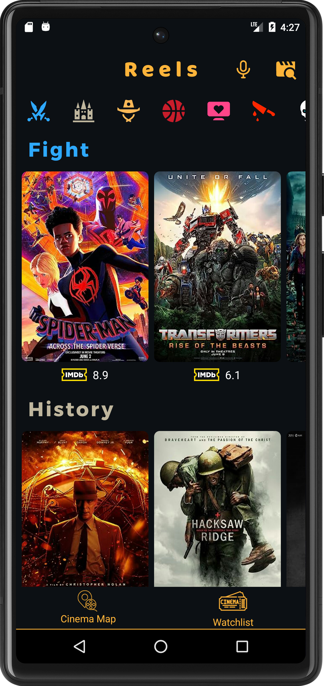

### Status Bar
O 1º elemento que se encontra no topo do ecra é a status bar que contem 3 elementos:
- O titulo da Aplicação, que é "Reels"
- O icone do microfone que ativa a pesquisa por voz
- O icone de pesquisa por texto que ativa a search view para procurar um filme por texto

#### Pesquisar filme por voz

Quando se pressiona o icone do microfone na status bar, isso invoca um menu que utiliza o serviço de reconhecimento de voz do google para traduzir o que o utilizador diz em texto **(este serviço só funciona quando o equipamento tem acesso à internet)**

**Esta funcionalidade consegue encontrar qualquer filme registado ou não registado na aplicação, isto,porque este menu faz uma pesquisa no API pelo filme e caso este exista a informação sobre o filme é imediatamente carregada para a App permitindo ao utilizador registar qualquer filme que queira.
Isto foi uma funcionalidade extra que eu implementei e que eu acho que é de grande uso para o utilizador porque permite ao utilizador registar qualquer filme não estando limitado aos filmes que possam estar hardecoded na App**

#### Pesquisa de filme por texto

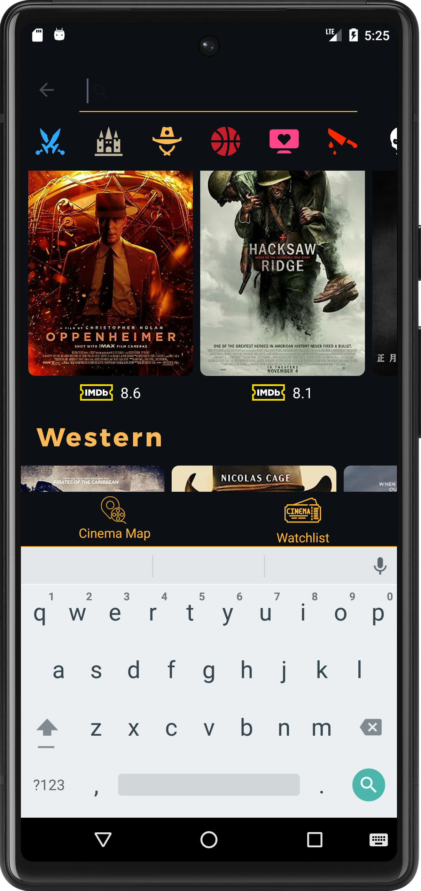

Ao pressionar o icone de pesquisa por texto (o que se encontra no lado direito do icone do microfone) o utilizador invoca uma search view aonde pode escrever o nome de qualquer filme que esteja registado na aplicação ou no API na aplicação. O que vai acontencer é o seguinte:
- Se o utilizador escrever o nome completo  de um filme e este corresponde a um titulo válido de um filme já registado na app o utilizador vai ser levado para o ecrã do detalhe do filme. Isto permite fazer pesquisa de filmes já registados em modo offline desde que o titulo inserido corresponda letra por letra ao titulo do filme (não é preciso inserir nenhuma letra em maiscula).
- Caso o titulo inserido do filme não corresponda a nenhum filme registado na app, é feita uma pesquisa no API (se não houver internet a app devolve um erro em forma de mensagem Toast). O API devolve os dados de um filme que achou ser o correto e esses dados são descarregados e processados na app levando o utilizador para o registo do filme (caso o API não encontre o filme a app devolve um erro em forma de mensagem de Toast)

### Scroll Bar horizontal
Por debaixo da Status Bar da aplicação vê-se um conjunto de icones. Isto é uma das funcionalidades extra que implementei que utiliza uma scroll view horizontal, que quando o utilizador carrega num dos icones, o ecrã faz scroll para cima ou baixo para a recycler view correspondente ao icone pressionado. 

A cor do icone corresponde ao titulo da recycler view, por exemplo o primeiro icone é azul que corresponde ao "Fight movies", o segundo icone é castanho claro que corresponde aos "History movies", etc.

### Posters dos filmes (recycling views)
O ecrã principal é alimentado por **8 recycler views verticais**, cada uma representa um género diferente de filmes. Se o utilizador navegar horizontalmente numa recycling view irá ver mais filmes do mesmo género (max 20 por recycling view) e se navegar verticalmente na aplicação irá ver outras recycling views com filmes de outros géneros. 

Cada filme tem debaixo do poster a classificação IMDB retirada do API~

## Barra Inferior (Bottom Bar)
No inferior do ecrã temos uma bottom bar que dá acesso ao mapa de cinemas (cinema Map) que mostra um mapa com a lista dos cinemas carregados apartir do json fornecido no enunciado e depois mostra os cinemas aonde o utilizador já viu um filme

O outro icone leva o utilizador à lista de filmes já registados (watchlist) aonde o utilizador pode ver os filmes que já registou e pode ver o detalhe dos filmes

## Mapa dos filmes
Ao pressionar o icone "Cinema Map" na barra inferior do ecrã principal o utilizador é levado para o ecrã mostrado abaixo

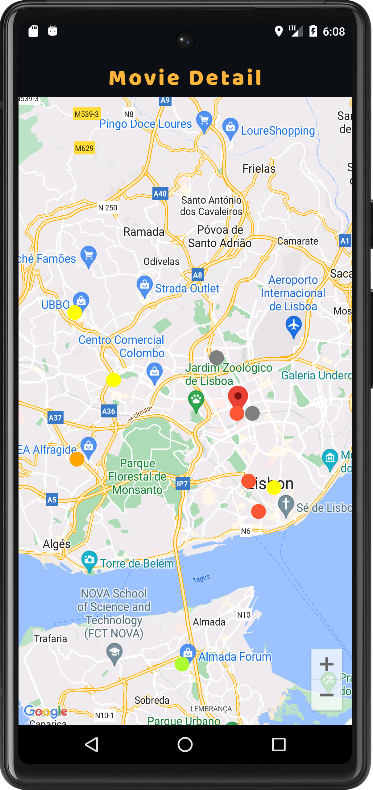

Neste ecrã existe um mapa aonde a localização atual do utilizador está marcada com um pin vermelho.
À volta estão vários circulos com cores diversas que representam os cinemas obtidos apartir da lista do enunciado, cada circulo é colocado no mapa apartir das coordenadas geograficas do ficheiro json fornecido.

A cor de cada circulo que representa um cinema tem uma cor associada ao rating de um dos filmes registados naquele cinema, quanto mais baixo for o rating mais vermelho o circulo fica. Quanto mais alto for o rating a cor vai subindo desde o vermelho, depois para o amarelo e finalmente para o verde que indica que o filme teve um rating alto (a cor do circulo é baseado no rating de um dos filmes do cinema). Cinemas que tenham uma cor cinzenta significa que não tem um filme associado.

Quando o utilizador pressiona um cinema que tenha uma cor (que não cinzento) ele será levado para o detalhe do respetivo filme.

## Ver filmes já registados (Watched List)
Ao pressionar o icone "WatchList" na barra inferior do ecrã principal o utilizador é levado para o ecrã mostrado abaixo

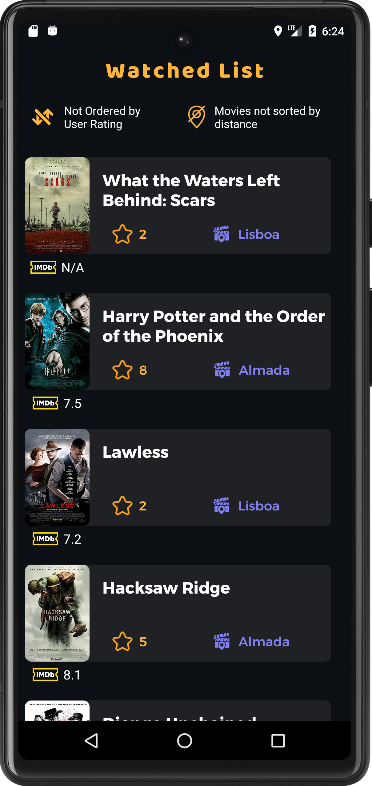

Este ecrã tem uma lista de todos os filmes registados pelo utilizador (e portanto está inicialmente vazio quando a aplicação é utilizada na primeira vez). Cada filme tem o rating que o utilizador deu a amarelo e a cidade do cinema aonde o filme foi visto. Quando o utilizador carrega num dos items da recycling view que contem os filmes ele será levado para o detalhe do filme (que será mostrado mais abaixo)

Neste ecrã temos por cima da recycling view 2 opções para ordenar/filtrar os filmes **(ao pressionar os icones amarelos)**, podemos ordernar por ordem descendente e ascendente do rating que o utilizador deu 
e/ou podemos só ver filmes que estejam a 500m/1000m ou menos da localização atual do utilizador. 

**Ambos os filtros funcionam individualmente ou em conjunto**

A imagem abaixo mostra ambos os filtros a serem usados em conjunto

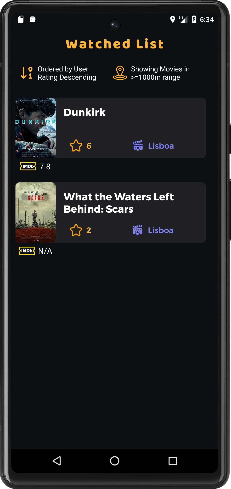

Como indicado no enunciado este ecrã é o único que deve permitir ser colocado em modo landscape sem perda de dados. A imagem abaixo mostra isso mesmo

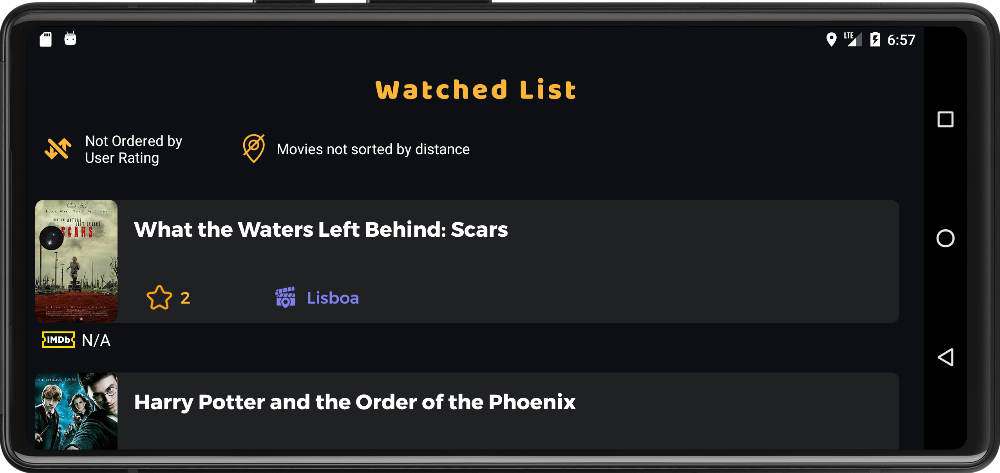

## Detalhe do filme (Movie Detail)
O ecrã detalhe do filme pode ser invocado através de várias formas:
- Ao pressionar um filme no ecrã principal;
- Ao pressionar um cinema no mapa de cinemas;
- Ao pressionar um dos items da recycling view na lista de filmes vistos;
- Ao pesquisar um filme no ecrã principal por voz ou texto;

A imagem abaixo mostra o detalhe de um filme

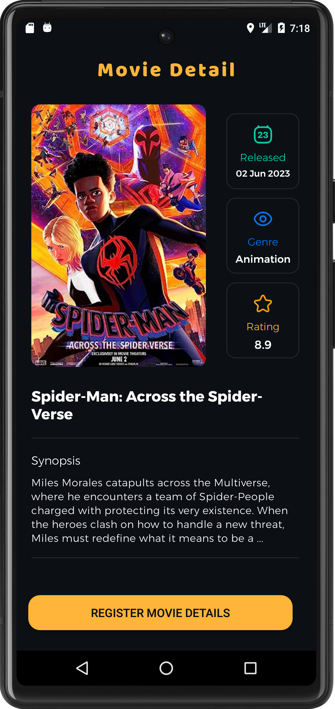

O detalhe de todos os filmes são alimentados por informações retirada do API e guardadas na BD, portanto o detalhe de qualquer filme registados pode ser consultado offline

Quando o utilizador pressiona o botão de registar filmes (register movie details) é levado para o ecrã abaixo

Após o registo do filme ser concluido o ecrã do detalhe do filme fica diferente, passa a mostrar um ticket virtual com as informações do filme, é outra funcionalidade extra que inseri e foi preciso trabalhar o UI com muito cuidado e demorou bastante tempo a acertar tudo mas acho que faz a aplicação sobresair muito mais

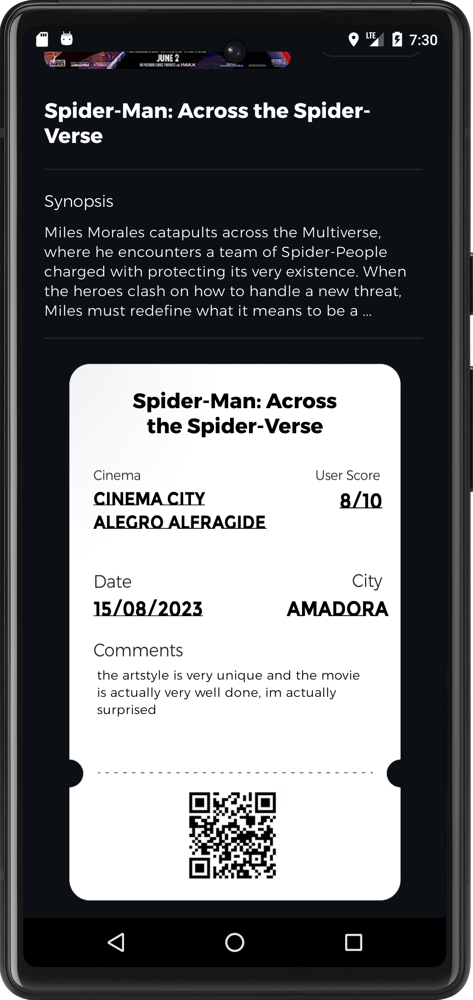

## Registo de filmes (movie registration)
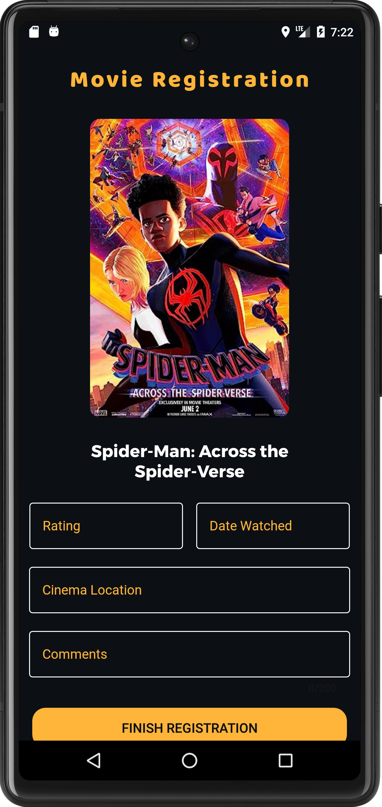

Este é o ecrã aonde se regista o filme. De acordo com o que foi pedido o utilizador tem várias restrições:
- O "rating" só aceita números de 1 a 10
- O "date watched" só aceita datas no dia de hoje ou no passado
- O "cinema location" só permite inserir cinemas obtidos apartir do json fornecido
- Os "comments" só permite um máximo de 200 caracteres e são opcionais

Só após todas estas restrições estarem preenchidas é que podemos finalizar o registo do filme. O ecrã abaixo mostra o que acontece quando o utilizador tenta selecionar um dos cinemas válidos.

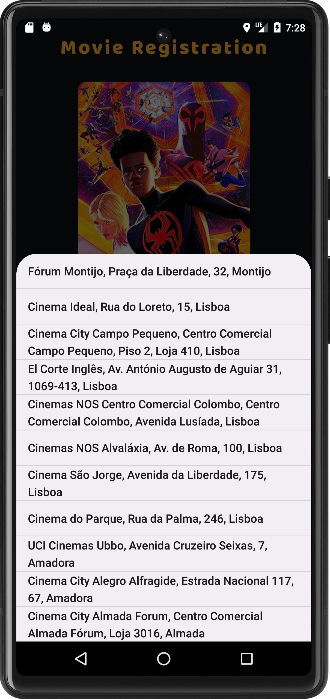

## Suporte multi-idioma
Outro requesito pedido foi que a app tem que suportar pelo menos 3 linguas.
As linguas escolhidas foram o ingles como default, e depois se a linguagem do sistema mudar para portugues de portugal ou espanhol, a linguagem da app tambem muda, sendo estas as 3 linguas suportadas.

Abaixo encontram-se 2 imagens da app em espanhol

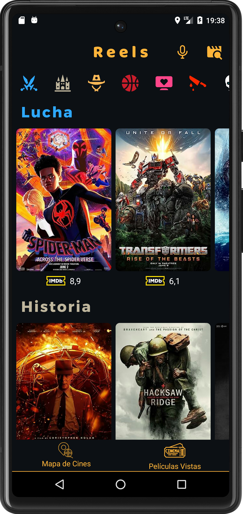

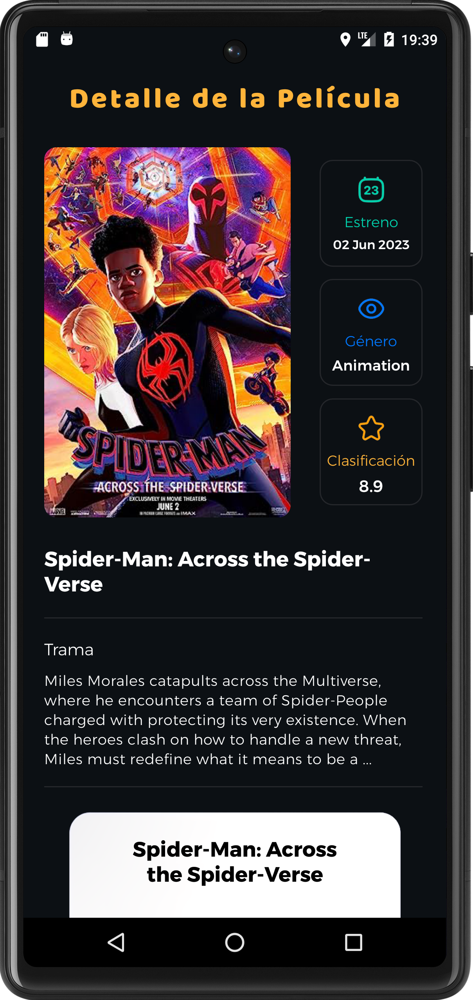